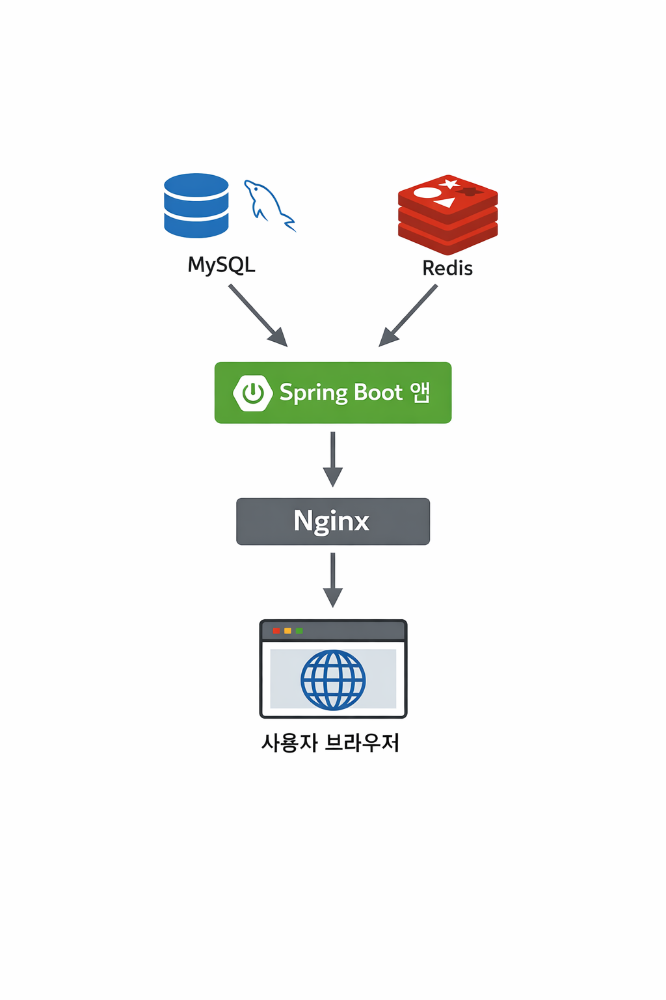

📌 StudyOlle

📝 프로젝트 소개

Spring Boot  + Thymeleaf 기반 SSR 구조의 스터디 관리 웹 애플리케이션입니다.

Docker 컨테이너 환경에서 실행되며, GitHub Actions를 통해 EC2에 자동 배포되도록 CI/CD 파이프라인을 구축했습니다.

---


🚀 기술 스택

Backend
- Java17
- Spring Boot
- Spring Security
- JPA
- MySQL
- Redis

View
- Thymeleaf(SSR)

DevOps
- Docker
- Docker Compose
- Nginx
- GitHub Actions
- AWS EC2

---

✨ 주요 기능
1. 계정 관리
   - 회원 가입 , 로그인/자동로그인/로그아웃
   - 프로필 관리
   - 가입 인증 이메일 보내기
2. 스터디 및 모임 관리
   - 스터디 생성, 수정, 삭제
   - 스터디 구성원 조회
   - 관심 태그 및 지역 기반 스터디 검색 기능
   - 스터디 내 개별 모임(Event) 생성 및 일정 관리
3. 알림 기능
   - 사용자가 설정한 관심 주제와 지역을 기반으로 조건에 맞는 스터디가 생성될 시 알림 제공
   - @EventListener를 통해 관심 태그 및 지역 조건에 맞는 사용자 필터링
   - 가입한 스터디에서 새로운 모임이 생성되면 알림 제공
   - 알림은 사용자 설정에 따라 이메일 또는 웹으로 알림 발송
4. 검색 기능
   - 스터디 제목 , 관심주제 , 지역 기반 스터디 검색기능
  
---

🐳 Docker 환경
- Local: MySQL, Redis 컨테이너 사용 (App은 로컬 실행)
- Production: App, Nginx, MySQL, Redis 전체 Docker Compose 구성
- 하나의 docker-compose.yml에서 profiles 기능을 활용해 환경 분리

---


⚙️ 아키텍처
- MySQL과 Redis는 컨테이너로 관리
- Spring Boot 앱은 로컬 실행 가능 또는 컨테이너 실행 가능
- Nginx를 통해 HTTPS 적용 및 리버스 프록시 제공



---

🖥 Local 실행 방법
  - 프로젝트 클론
    ``` bash
    git clone https://github.com/studyolle.git
    ```
   - redis / mysql 실행
     ``` bash
     docker-compose up -d --build
     ```
   - app 실행 By IDE
     - IntelliJ 실행
     - application-local.yml 프로파일 사용
     - Active Profile: local
   - app 실행 By CLI
     ``` bash
     ./gradlew bootRun --args='--spring.profiles.active=local'
     ``` 

---

☁️ 배포 환경 (EC2)

---

🛠  향후 개선 사항
  - ▢ flyway 적용
  - ▢ 프로퍼티 파일 민감정보 암호화
  - ✅ 로컬 실행 환경 docker로 변경
  - ✅ 배포시 사용할 nginx / app 이미지는 doker hub에서 관리하기 
  - ✅ 자동 로그인 변경 (rember-me --> jwt )
  - ▢ 회원가입 인증 이메일 보내기 비동기로 처리하기
  - ▢ app 도커 이미지 용량 줄이기 ( 멀티스테이지로 이미지 만들기 )
  - ▢ CI/CD 구축 (GithubActions)
  - ✅ 배포 테스트 후 https 적용하기
  - ▢ 배포 완료 후 Terraform 적용하기
